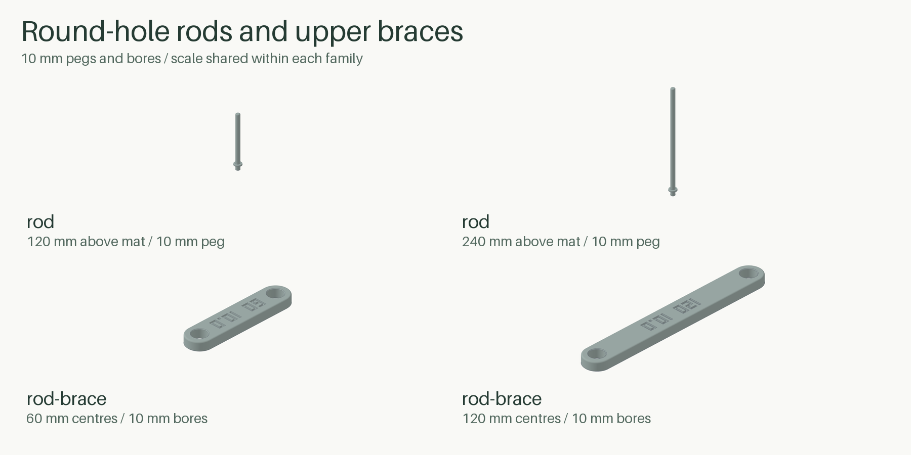

# Cargo-Grid

Cargo-Grid makes modular cargo-mat tiles and accessories from Python. The standard setup uses 60 mm units, 13 mm-thick tiles, original roofed edge joints and the full 10 mm hole pattern. You can export one part, a floor fitted to an exact rectangle, or a bounded catalogue as STEP, STL and editable 3MF files.


## Make a 2x1 tile

Install `uv`, clone or download this repository, then run these commands from the repository folder:

```sh
uv sync
uv run cargo-grid part --build-width-mm 150 --build-depth-mm 150 --build-height-mm 50 --width-cells 2 --depth-cells 1 --output outputs/first-tile
```

At the standard 60/13 settings, this makes a nominal 126x66x13 mm tile with original roofed joints and all 13 available 10 mm holes. `outputs/first-tile` contains:

- a named STEP file for CAD work;
- an STL mesh;
- `job.3mf`;
- `manifest.json`, which records dimensions, quantities, placement and validation results.

The three build dimensions describe available printer space in millimeters: width is X/left-right, depth is Y/front-back and height is Z. Change them to suit your printer. Cargo-Grid refuses to overwrite an existing output directory, so use a new name for each run.

## Choose the tile size and pattern

`--width-cells` and `--depth-cells` set the tile grid. Add `--copy-count 2` when you want two copies of the same part rather than one larger tile.

Full 10 mm round holes are the default, including retained edge and corner sites. Use `--no-holes` for solid webs:

```sh
uv run cargo-grid part --build-width-mm 150 --build-depth-mm 150 --build-height-mm 50 --width-cells 2 --depth-cells 1 --no-holes --output outputs/solid-pattern
```

`--holes` remains available when you want to spell the choice out. Use `--hole-diameter-mm` to change 10 mm or `--hole-scope interior` when you only want complete interior holes. X attachment centres and other protected interfaces are never drilled. At small unit sizes, keep-outs can reject every requested hole; the CLI then suggests a smaller diameter or `--no-holes`.

Unit size and tile thickness are separate controls. This example uses 30 mm units but keeps the tile 13 mm thick:

```sh
uv run cargo-grid part --unit-size-mm 30 --tile-thickness-mm 13 --build-width-mm 100 --build-depth-mm 100 --build-height-mm 50 --no-holes --output outputs/30mm-unit
```

Parts made with the same custom unit size, thickness and fit offset match one another. They aren't meant to mix with standard 60/13 parts.


For a floor that must fill an exact rectangle, use `layout`. Whole cells at the selected unit size stay in the middle, and the leftover width and depth become built-in edge material:

```sh
uv run cargo-grid layout --build-width-mm 150 --build-depth-mm 150 --build-height-mm 50 --layout-width-mm 320 --layout-depth-mm 230 --filler-placement balanced --output outputs/exact-floor
```

## Browse and generate accessories

At the standard 60/13 settings, the documented 350x320x325 mm build envelope fits 105 accessories: female and male ramps, attachment plates, five vertical tile brackets, eight normal stops, two angled stops, round-hole rods and upper braces, edge/corner pieces and separate support rails/connectors. The catalogue selects one perimeter form for each outward width to match its tiles: 10, 20 and 30 mm edges complete accepted boundary holes when the tile pattern has them. Holeless or interior-only tiles select plain perimeter parts at every width. A different unit size or build envelope can change what fits.


See the [complete illustrated attachment list](docs/attachments.md) for part names, dimensions and individual thumbnails.

Generate one accessory with `part`:

```sh
uv run cargo-grid part --family plate --width-cells 1 --depth-cells 1 --build-width-mm 150 --build-depth-mm 150 --build-height-mm 80 --output outputs/x-plate
```

For a wider finishing strip, select its total outward projection. A 20 or 30 mm standalone part follows the normal full 10 mm-hole tile pattern unless `--plain-edge` is given. `--complete-edge-holes` makes that choice explicit, and `--hole-diameter-mm` changes the matching tile and perimeter opening together:

```sh
uv run cargo-grid part --family edge-y --length-cells 2 --edge-outward-mm 30 --complete-edge-holes --build-width-mm 150 --build-depth-mm 150 --build-height-mm 50 --output outputs/wide-edge
```

The same options apply to `edge-x`, `corner-in` and `corner-out`. All three outward widths can complete accepted boundary sites or remain plain with `--plain-edge`. If a requested diameter has no accepted boundary site, automatic matching keeps the perimeter plain; an explicit completion request reports the unsupported combination.

For Bambu output, attachment plates are flipped X=180 degrees so the broad plate body starts on the bed and the X plugs grow upward. STEP, STL and core 3MF keep the source orientation.

Every generated Bambu project keeps Slice gap closing radius at 0.01 mm and Resolution at 0.003 mm as process overrides. These settings affect slicing only; they do not change the CAD geometry, STEP, STL, core 3MF, nozzle size or layer height. Check the sliced result with the printer and material profiles you plan to use.

Generate every supported tile and accessory that fits your build envelope with `catalogue`:

```sh
uv run cargo-grid catalogue --build-width-mm 350 --build-depth-mm 320 --build-height-mm 325 --output outputs/catalogue
```

The manifest lists anything omitted because it did not fit.

## Make the full H2D catalogue

This standard-only command creates the documented H2D project: 25 tile sizes with the full 10 mm hole pattern and all 105 accessories. It packs them onto named, family-grouped plates, including `Rods and upper braces`; the manifest records the plate count. It requires 60 mm units, 13 mm thickness and zero fit offset. Perimeter parts are grouped by outward projection and their selected hole mode, while individual object names retain their edge direction, corner variant and connector sex.

```sh
uv run cargo-grid catalogue --h2d-dual-safe --build-width-mm 350 --build-depth-mm 320 --build-height-mm 325 --bambu --material "Bambu PETG Basic @BBL H2D 0.8 nozzle" PETG "#637b70" --nozzle-diameter-mm 0.8 --layer-height-mm 0.32 --no-stl --output outputs/full-catalogue
```

Open `outputs/full-catalogue/job.3mf` as a project. Common plates keep model bounds inside the H2D shared reach (X=25..325, Y=0..320, Z<=320) and add another 5 mm model inset. The default layout leaves at least 4 mm of XY clearance between actual parts. Fast rectangle-packed plates enforce this conservatively between model bounds; eligible perimeter groups use all-height projected model footprints only when their concave shapes reduce the plate count. The 306x306 mm 5x5 tile needs the wider left-nozzle area, so it gets its own `5x5 TILE - SINGLE NOZZLE ONLY - LEFT` plate and maps slot 1 to the left nozzle. Other plates use automatic `Auto For Match`. This clearance does not account for every possible brim, support or tower path and is not print approval; inspect the sliced project.

The project names the H2D 0.8 nozzle, 0.32 mm Balanced Strength process, Textured PEI plate and Bambu PETG Basic profile. Confirm those profiles and your loaded filament before slicing. The catalogue does not add PLA roof interfaces to tiles; the PETG/PLA roof-support job below remains a separate tile-only workflow.

The 3MF is an unsliced project. Open it as a project, then slice and inspect every plate you plan to print.

## Round-hole rods and upper braces

Rods fit the mat's round holes, with a collar resting on its top. Choose 120 or 240 mm above-mat height; the peg adds another 12 mm at standard tile thickness. Upper braces connect two Ø10 mm shafts at 60 or 120 mm centres. That spacing stays in physical millimetres when unit size changes.



```sh
uv run cargo-grid part --family rod --rod-height-mm 120 --peg-diameter-mm 10 --build-width-mm 350 --build-depth-mm 320 --build-height-mm 325 --bambu --material "Model PETG" PETG "#637b70" --nozzle-diameter-mm 0.8 --layer-height-mm 0.32 --output outputs/rod
uv run cargo-grid part --family rod-brace --brace-spacing-mm 60 --bore-diameter-mm 10 --build-width-mm 150 --build-depth-mm 150 --build-height-mm 50 --output outputs/upper-brace
```

Bambu projects lay rods horizontally at Y=90 degrees with normal Auto support for rod objects only. Braces print flat, bores upright, without object support. The official braces use 10 mm bores for the 10 mm shafts. Remove rod support before fitting.

Keep bags resting on the mat, not hanging from the rods. A brace may slide or jam on its rods; it is not a positive height lock. These parts have no hooks or load/crash rating.

## Vertical tile brackets

A bracket holds a separate ordinary tile upright. The usual placement has the tile underside facing out, but the wall posts also let the top face outward. The solid backing makes covered holes blind while the tile is fitted.


The part names state both footprints:

| Bracket | Floor base | Upright wall |
| --- | --- | --- |
| Deep tall | 1x2 | 1x2 |
| Wide low | 2x1 | 2x1 |
| Deep square | 2x2 | 2x2 |
| Shallow tall | 1x1 | 1x2 |
| Shallow wide | 2x1 | 2x2 |

For brackets, `--width-cells` sets the shared X width, `--depth-cells` sets floor depth and `--panel-height-cells` sets wall height. Omit panel height to match the floor depth.

```sh
uv run cargo-grid part --family vertical-tile-bracket --width-cells 1 --depth-cells 1 --panel-height-cells 2 --build-width-mm 350 --build-depth-mm 320 --build-height-mm 325 --bambu --material "Model PETG" PETG "#637b70" --nozzle-diameter-mm 0.4 --layer-height-mm 0.2 --output outputs/shallow-tall-bracket
```

This exports the bracket only. Generate its 1x1 floor tile and 1x2 wall tile separately with the same unit size, tile thickness and fit offset.

The wall posts have no wide flare at the seating face. Their straight stem is inset by 0.08 mm, followed by a 0.1 mm transition to the unchanged 2 mm rounded tip. For the top face outward, rotate the wall tile Z=180 degrees and then X=-90 degrees before placing it on the same post centres. Give every adjoining wall tile the same orientation because left and right swap when the tile is turned this way. The rounded tip crosses the narrow opening during straight insertion, so insertion force and retention depend on the printed material and tolerances.

Bambu projects place the original three brackets on their diagonal rear face (about X=133–134 degrees, depending on depth). The shallow brackets use Y=-90 degrees with a broad side down and turn on normal Auto support for those objects. That support can reach both the floor and wall X mating areas, so remove it fully before trying the fit.

## Normal and angled cargo stops

`vertical-stop` is a filled triangular cargo wedge, not a tile holder or a request for 100% slicer infill. The catalogue has 1x1, 1x2, 2x1 and 2x2 bases at 60 mm and 120 mm shoulder heights.


```sh
uv run cargo-grid part --family vertical-stop --width-cells 2 --depth-cells 1 --stop-height-mm 120 --build-width-mm 350 --build-depth-mm 320 --build-height-mm 325 --bambu --material "Model PETG" PETG "#637b70" --nozzle-diameter-mm 0.4 --layer-height-mm 0.2 --output outputs/vertical-stop
```

Every free outer edge is R2; the X plugs and roots keep their mating shape. Bambu rotates each normal stop onto its broad rear face and enables normal Auto support for that object. Support can reach the mounting area on the standard 1x1/H120 and 2x1/H120 stops, so remove it before trying the fit.

The two `lock-45` angled stops are also filled wedges. Their free body edges are R2, their X geometry is unchanged and Bambu places them X=-135 degrees with the rear face down.

## Floor ramps

`ramp` makes a floor-to-mat transition whose rise follows tile thickness. Its slope run stays fixed at 50 mm; `--width-cells` sets its width in whole unit cells. Each cell has one original tile-edge joint: female pockets by default, or male tabs with `--ramp-join male`. These are the same joining shapes used on tile edges, not X attachment plugs.


```sh
uv run cargo-grid part --family ramp --width-cells 3 --build-width-mm 350 --build-depth-mm 320 --build-height-mm 325 --bambu --material "Model PETG" PETG "#637b70" --nozzle-diameter-mm 0.4 --layer-height-mm 0.2 --output outputs/ramp
uv run cargo-grid part --family ramp --width-cells 3 --ramp-join male --build-width-mm 350 --build-depth-mm 320 --build-height-mm 325 --output outputs/male-ramp
```

The default female ramp receives a tile's north male edge and extends away in positive Y. The male ramp fits a tile's female south or west edge: rotate it 180 degrees around Z for the south edge, or 90 degrees around Z for the west edge, then move its tall boundary against that tile edge. Rotation changes placement, not joining sex.

Male tabs project beyond the 50 mm slope by one tenth of the unit size. At standard 60/13 settings, a three-cell male ramp measures 180 x 56 x 13 mm overall; its slope still runs 50 mm. Both versions keep the underside at Z=0. Custom unit size and thickness work with matching original roofed interfaces; full-height ramp joints remain unsupported.

The high shelf flows into the slope through a broad R32 curve. At standard thickness this leaves about 6.28 mm of flat shelf without changing the joining rim or pocket roof. Thicker custom ramps use a smaller radius when needed to keep at least 2 mm of flat shelf; side and nose rounds stay R2.

Bambu projects request normal Auto support for female-pocket roofs and leave male-ramp object support off. The male tabs start as separate first-layer islands before joining the body, so inspect their bed contact and adhesion. Remove any support from mating surfaces before assembly. Printed fit and load suitability still need a physical check.

## Support the underside joint bridges

The receiving side of an original tile joint has a small bridge or ceiling over an open pocket. Cargo-Grid calls that ceiling the **roof**. If you print it without enough bridging performance, it can sag into the joint.

For a two-nozzle PETG tile with a PLA contact interface, Cargo-Grid can add removable support under the west/south roofs:

```sh
uv run cargo-grid part --build-width-mm 350 --build-depth-mm 320 --build-height-mm 325 --build-margin-mm 37 --width-cells 2 --depth-cells 1 --copy-count 2 --bambu --material "Model PETG" PETG "#778877" --material "Interface PLA" PLA "#dddddd" --nozzle-diameter-mm 0.8 --layer-height-mm 0.32 --roof-support --output outputs/roof-job
```

Open `outputs/roof-job/job.3mf` as a project and choose your actual printer, bed, process and filament profiles. Cargo-Grid sets PETG for the model/support base and PLA for the dense top interface, with:

| Setting | Value |
| --- | --- |
| Top contact distance | 0 mm |
| Independent support layer height | off |
| Top interface spacing | 0 mm |
| Top interface layers | 2 |
| Build plate only | off |
| Support/object XY distance | 0.40 mm |

This zero-gap contact is only for the PETG/PLA pairing. Do not use it with the same material on both sides or an untested pair that may fuse.

Before printing:

1. Check the printer, bed and PETG/PLA assignments.
2. Slice and inspect the roof from below. The PLA interface must meet the bottom of the first PETG roof layer.
3. Check that the protected X openings remain clear.
4. On a full-hole 2x1 tile, support intentionally occupies the three round edge cutouts at (0,30), (30,0) and (90,0) during printing. Remove it through the open underside/female edge afterward.
5. Recheck support, brim, tower and warnings whenever the profile or material changes.

## CLI reference

```sh
uv run cargo-grid --help
uv run cargo-grid part --help
uv run cargo-grid layout --help
uv run cargo-grid catalogue --help
```

`part` makes one design, `layout` fills a requested rectangle and `catalogue` lists the supported designs that fit. Normal generation doesn't need a downloaded reference model.

Common options:

- `--build-width-mm`, `--build-depth-mm`, `--build-height-mm`: available X/Y/Z print space;
- `--unit-size-mm`: cell size and matching nominal local-plane interface scale, default 60 mm;
- `--tile-thickness-mm`: independent body thickness and connector insertion depth, default 13 mm;
- `--width-cells`, `--depth-cells`: one tile or two-axis accessory;
- `--panel-height-cells`: bracket wall rows, separate from floor depth;
- `--length-cells`: edge strips and support rails;
- `--edge-outward-mm`: 10, 20 or 30 mm horizontal projection for edge/corner parts;
- `--complete-edge-holes`: explicitly continue matching accepted tile-boundary sites through a 10, 20 or 30 mm edge/corner;
- `--plain-edge`: keep a 10, 20 or 30 mm standalone edge/corner plain instead of using automatic tile-pattern matching;
- `--rod-height-mm`, `--peg-diameter-mm`: rod height above the mat and round insertion peg;
- `--brace-spacing-mm`, `--bore-diameter-mm`: physical brace centre spacing and bore diameter;
- `--copy-count`: repeated copies of one design;
- `--layout-width-mm`, `--layout-depth-mm`: finished rectangular layout;
- `--packing-gap-mm`: catalogue separation.

This alpha replaced several older option names:

| Earlier option | Current option |
| --- | --- |
| `--cells X Y` | `--width-cells X --depth-cells Y` |
| `--footprint W D` | `--layout-width-mm W --layout-depth-mm D` |
| `--quantity N` | `--copy-count N` |
| `--margin` | `--build-margin-mm` |
| `--part-gap` | `--packing-gap-mm` |
| `--pitch`, `--grid-pitch-mm` | `--unit-size-mm` |
| `--height`, `--tile-height-mm` | `--tile-thickness-mm` |
| `--fit-offset` | `--fit-offset-mm` |
| `--nozzle`, `--layer-height`, `--hole-diameter` | `--nozzle-diameter-mm`, `--layer-height-mm`, `--hole-diameter-mm` |
| `--accessory-height`, `--length`, `--variant` | `--stop-height-mm`, `--connector-length-mm`, `--variant-number` |

See `--help` for build reservations/exclusions, stacking and advanced roof-support settings.

## Compatibility notes

Original roofed joints are the default. At standard 60/13 dimensions, the male ledge reaches Z=10 and the female roof is at Z=10.2. Unit size changes cell spacing and scales the X and tile-edge profiles in their own plane. Tile thickness changes the body, plug depth and roof/ledge heights. Fit offset, the 0.2 mm seating gap, the 0.08 mm bracket-stem inset, hole diameter and comfort radii stay in millimetres.

`--joint-style full-height` is an experimental open-through **tile-edge joint**. It has nothing to do with stop height or printer build height. At standard 60/13 dimensions, one upper web is only about 0.146 mm thick and opens near the top. Its male tabs also don't fit the original roofed pockets. The [geometry reference](docs/geometry.md#open-through-tile-edge-joints) has the details.

The full 10 mm hole pattern is on by default. Use `--no-holes` to opt out. The manifest records holes rejected by an interface or edge keep-out.

Unit size must be at least 30 mm and tile thickness at least 6 mm. The 2x2 angled stop supports unit sizes up to 60 mm; use its 1x1 version with a larger unit. H2D dual-safe packing remains a standard 60/13-only layout.

## Stacking identical tiles

Stacking adds sacrificial support-base and release-interface volumes between copies of the same tile:

```sh
uv run cargo-grid part --build-width-mm 150 --build-depth-mm 150 --build-height-mm 70 --width-cells 1 --depth-cells 1 --copy-count 4 --bambu --material "Model PETG" PETG "#778877" --material "Release PLA" PLA "#dddddd" --nozzle-diameter-mm 0.4 --layer-height-mm 0.2 --stack-count 2 --stack-gap-mm 1 --stack-interface-thickness-mm 0.2 --stack-material-slots 1 1 2 --output outputs/stack-job
```

`--stack-count auto` uses the available height. Roof support and stacking cannot be combined, and mixed catalogue stacking is not supported.

## Python API

```python
from pathlib import Path
from cargo_grid import BuildVolume, Tile
from cargo_grid.export import export_job
from cargo_grid.jobs import Job, tile_design

design = tile_design(Tile(nx=2, ny=1))
export_job(Job([design], BuildVolume(150, 150, 50), "part"), Path("outputs/python-job"))
```

For a custom matching tile/X-joint set, pass the same `Interface` to each part. Round rods and braces instead have their own millimetre parameters; changing rod tile thickness adjusts only its insertion depth. The API keeps the stable `pitch` and `height` field names:

```python
from cargo_grid import Interface, Tile

compact = Interface(pitch=30, height=13)
solid_tile = Tile(nx=2, ny=1, interface=compact, hole_diameter=None)
```

Accessory example:

```python
from cargo_grid.accessories import Accessory
from cargo_grid.catalogue import accessory_design

bracket = accessory_design(Accessory("vertical-tile-bracket", nx=1, ny=1, panel_height_cells=2))
```

Contributor checks and release steps are in the [release checklist](docs/release-checklist.md). The accessory page has separate [gallery reproduction instructions](docs/attachments.md#reproduce-the-images).

## License and reference boundary

[The MIT license](LICENSE) covers this source code. Functional measurements of Tora.'s MakerWorld trunk-organizer mat informed the interface work; that model has separate terms. This repository does not include its meshes, images, profiles or private files.

Python parameters are the editable design source. STEP, STL, 3MF and gallery images are generated from it. Cargo-Grid does not connect to a printer or start prints.
