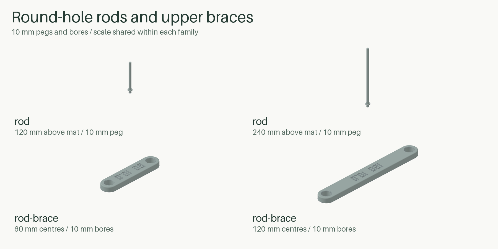

# Cargo-Grid

Cargo-Grid makes modular cargo-mat tiles and accessories from Python. The standard setup uses 60 mm units, 13 mm-thick tiles, original roofed edge joints and the full 10 mm hole pattern. You can export one part, a floor fitted to an exact rectangle, or a catalogue of everything that fits your printer, as STEP, STL and editable 3MF files.


## Make a 2x1 tile

Install `uv`, clone or download this repository, then run these commands from the repository folder:

```sh
uv sync
uv run cargo-grid part --build-width-mm 150 --build-depth-mm 150 --build-height-mm 50 --width-cells 2 --depth-cells 1 --output outputs/first-tile
```

At the standard 60/13 settings, this makes a 126x66x13 mm tile (including its joining tabs) with 13 round 10 mm holes. `outputs/first-tile` contains:

- a named STEP file for CAD work;
- an STL mesh;
- `job.3mf`;
- `manifest.json`, which records dimensions, quantities, placement and the checks that ran.

The three build dimensions describe available printer space in millimeters: width is X/left-right, depth is Y/front-back and height is Z. Change them to suit your printer. Cargo-Grid refuses to overwrite an existing output directory, so use a new name for each run.

## Choose the tile size and pattern

`--width-cells` and `--depth-cells` set the tile grid. Add `--copy-count 2` when you want two copies of the same part rather than one larger tile.

By default a tile gets the full pattern of 10 mm round holes, including the half and quarter holes on its edges and corners that the neighbouring part completes. Use `--no-holes` for a tile without them:

```sh
uv run cargo-grid part --build-width-mm 150 --build-depth-mm 150 --build-height-mm 50 --width-cells 2 --depth-cells 1 --no-holes --output outputs/solid-pattern
```

`--holes` asks for the default pattern by name. Use `--hole-diameter-mm` to change the 10 mm size, or `--hole-scope interior` for whole holes inside the tile only. Holes keep clear of the X sockets. At small unit sizes there may be no room for any hole; the CLI then suggests a smaller diameter or `--no-holes`.

Unit size and tile thickness are separate controls. This example uses 30 mm units but keeps the tile 13 mm thick:

```sh
uv run cargo-grid part --unit-size-mm 30 --tile-thickness-mm 13 --build-width-mm 100 --build-depth-mm 100 --build-height-mm 50 --no-holes --output outputs/30mm-unit
```

Parts made with the same custom unit size, thickness and fit offset match one another. They aren't meant to mix with standard 60/13 parts.


For a floor that must fill an exact rectangle, use `layout`. Whole cells at the selected unit size stay in the middle, and the leftover width and depth become built-in edge material:

```sh
uv run cargo-grid layout --build-width-mm 150 --build-depth-mm 150 --build-height-mm 50 --layout-width-mm 320 --layout-depth-mm 230 --filler-placement balanced --output outputs/exact-floor
```

### Close the underside

Add `--solid-bottom-thickness-mm` when you don't want dirt dropping through the mat. It adds a closed floor under the normal tile body, so the X sockets and round holes stop at that floor instead of going right through. This example adds 1.92 mm, six 0.32 mm layers; a whole number of layers is a sensible choice:

```sh
uv run cargo-grid part --build-width-mm 150 --build-depth-mm 150 --build-height-mm 50 --width-cells 2 --depth-cells 1 --solid-bottom-thickness-mm 1.92 --output outputs/solid-bottom
```

That tile is 14.92 mm thick. Sockets, holes, plugs and rod pegs keep their depth from the top, so X attachments and rods fit as usual. The edge joints run down through the floor, so a solid-bottom tile only joins tiles, edges, corners and ramps made with the same solid-bottom thickness. Edge and corner pieces get the same floor under their holes. 0 (the default) means no solid bottom.

Where it works:

- `part` for tiles, edges, corners and ramps, plus `layout`, `catalogue` (including `--h2d-dual-safe`) and `extras zeekr-7x`. Catalogues still make their X attachments, rods, braces and support rails without a floor.
- It can't be combined with stacking or `--joint-style full-height`.
- In the Zeekr set every piece gets the floor and sits that much higher, so recheck clearance under the lift-out panel.
- A vertical tile bracket's top-outward wall placement pushes its posts into the tile from underneath, so use a wall tile without a solid bottom there. The usual underside-outward placement works with either.

How well the floor keeps dust out, and what it does to fit, flatness and strength, hasn't been tested.

## Browse and generate accessories

At the standard 60/13 settings, a 350x320x325 mm build volume fits all 105 accessories: female and male ramps, attachment plates, five vertical tile brackets, eight normal stops, two angled stops, round-hole rods and upper braces, edge and corner pieces, and support rails with their connectors. Edge and corner pieces come in 10, 20 and 30 mm widths. With the full hole pattern they carry the other half of the tiles' edge holes; with no holes or interior-only holes they are plain. A different unit size or build volume can change what fits.


See the [complete illustrated attachment list](docs/attachments.md) for part names, dimensions and individual thumbnails.

Generate one accessory with `part`:

```sh
uv run cargo-grid part --family plate --width-cells 1 --depth-cells 1 --build-width-mm 150 --build-depth-mm 150 --build-height-mm 80 --output outputs/x-plate
```

For an edge strip, `--edge-outward-mm` sets how far its body extends from the tile, not counting the joining tabs. Faces that meet a tile or the next edge or corner piece use the same 1 mm rounds as tiles, so those seams close up like tile-to-tile seams; the outward face keeps a softer 3 mm round. By default the strip carries the other half of the tile's 10 mm edge holes: `--complete-edge-holes` asks for them by name, `--plain-edge` leaves them out, and `--hole-diameter-mm` sets a different size to match your tiles:

```sh
uv run cargo-grid part --family edge-y --length-cells 2 --edge-outward-mm 30 --complete-edge-holes --build-width-mm 150 --build-depth-mm 150 --build-height-mm 50 --output outputs/wide-edge
```

The same options work for `edge-x`, `corner-in` and `corner-out` at every width. If no edge hole of the chosen size fits, the piece is made plain, or you get an error if you asked for holes with `--complete-edge-holes`.

In Bambu projects, attachment plates are flipped over (X=180 degrees) so the flat plate sits on the bed and the X plugs point up. Rail ends are flipped the same way: their underside slopes up toward the end, so they print on their flat top (the face the mat rests on) instead of balancing on the short flat part of the underside. Straight rails and connectors look the same either way up and print as modelled. The STEP, STL and plain 3MF files keep the model orientation.

Bambu projects set the slicer's Slice gap closing radius to 0.01 mm and Resolution to 0.003 mm. These only affect slicing, not the model files. Check the sliced result with the printer and material profiles you plan to use.

Generate every tile and accessory that fits your build volume with `catalogue`:

```sh
uv run cargo-grid catalogue --build-width-mm 350 --build-depth-mm 320 --build-height-mm 325 --output outputs/catalogue
```

The manifest lists anything omitted because it did not fit.

## Make the full H2D catalogue

This command makes a ready-packed project for a Bambu Lab H2D with 0.8 mm or 0.4 mm nozzles: 24 tile sizes with the full 10 mm hole pattern and all 105 accessories, on named plates grouped by family. It only works with the standard 60 mm unit, 13 mm thickness and no fit offset; you can add `--solid-bottom-thickness-mm`. Edges and corners share plates by outward width, and each object's name still says which edge, corner variant and male/female joint it has.

```sh
uv run cargo-grid catalogue --h2d-dual-safe --build-width-mm 350 --build-depth-mm 320 --build-height-mm 325 --bambu --material "Bambu PETG Basic @BBL H2D 0.8 nozzle" PETG "#637b70" --nozzle-diameter-mm 0.8 --layer-height-mm 0.32 --no-stl --output outputs/full-catalogue
```

Open `outputs/full-catalogue/job.3mf` as a project. Every part sits inside the area both H2D nozzles reach (X 25..325, Y 0..320, up to Z 320) with another 5 mm margin, parts are at least 4 mm apart, and every plate uses automatic filament matching (`Auto For Match`). The spacing doesn't allow for every brim, support or prime-tower path, so slice and check each plate before printing.

The 306x306 mm 5x5 tile is left out because it is wider than the 300 mm area both nozzles reach; the manifest lists it as omitted. To print one, make it with `part --width-cells 5 --depth-cells 5` and choose the nozzle yourself in Bambu Studio.

The project names the H2D 0.8 nozzle, 0.32 mm Balanced Strength process, Textured PEI plate and Bambu PETG Basic profile. Check those profiles and your loaded filament before slicing. To add supports with a PLA interface under the joint roofs, see [auto roof support](#auto-roof-support-for-catalogues-and-extras).

For 0.4 mm nozzles, use `--nozzle-diameter-mm 0.4 --layer-height-mm 0.24` and `--material "Bambu PETG Basic @BBL H2D 0.4 nozzle" PETG "#637b70"`. The project then names the H2D 0.4 nozzle and the 0.24 mm Standard process; the parts and plates are the same. With 0.2 mm layers the prime tower for [auto roof support](#auto-roof-support-for-catalogues-and-extras) gets too big for two catalogue plates. With auto roof support the matching PLA profile is `Bambu PLA Basic @BBL H2D`, which Bambu names without a nozzle size. `--h2d-dual-safe` accepts only these two nozzle and layer-height pairs.

## Make the Zeekr 7X expansion set

`extras zeekr-7x` makes every Zeekr-specific piece in one project: the ten 40 mm straight edges and the nine measured rear lift-out-panel contour pieces, 19 parts in all. The tiles and 30 mm north edges used with the rear panel are ordinary catalogue parts, so they are not in the set; print them with the commands further down.

```bash
uv run cargo-grid extras zeekr-7x --h2d-dual-safe --build-width-mm 350 --build-depth-mm 320 --build-height-mm 325 --bambu --material "Bambu PETG Basic @BBL H2D 0.8 nozzle" PETG "#637b70" --nozzle-diameter-mm 0.8 --layer-height-mm 0.32 --no-stl --output outputs/zeekr-7x-expansion-set
```

The H2D project keeps each family on its own named plates inside the common reach: `Zeekr 7X - Male 40mm edges`, `Zeekr 7X - Female 40mm edges`, `Zeekr 7X - Rear panel contour side caps`, and `Zeekr 7X - Rear panel south contour ramps 1` and `2` (the five ramps need two plates). Edge plates space parts 4 mm apart and contour plates 10 mm; `--packing-gap-mm` sets one spacing for every plate. Every plate uses automatic `Auto For Match` filament matching, and the manifest records the plates and placements.

The set needs the standard 60 mm unit, 13 mm thickness, original joints, zero fit offset and full 10 mm hole pattern, because the contour pieces are measured for that tile field. For plain or other-diameter 40 mm strips, make them one at a time with `part --family edge-x --length-cells 4 --edge-outward-mm 40` (or `edge-y` for female) plus `--plain-edge` or `--hole-diameter-mm`. For another printer, leave out `--h2d-dual-safe` and give its build size: the set keeps every straight-edge length that fits, and stops with an error if a contour piece doesn't fit.

Add `--solid-bottom-thickness-mm` to give every piece in the set a [solid bottom](#close-the-underside), and print the matching tiles and north edges with the same value. The outline doesn't change, but every piece is thicker and sits that much higher than in the test fit, so recheck clearance under the lift-out panel. The manifest records the thickness, and the contour piece names end in `_solid-bottom-<T>mm`.

Add `--roof-support --roof-support-mode auto` and a second material to get [auto roof support](#auto-roof-support-for-catalogues-and-extras) under the female joint roofs. On the H2D that means the PETG Basic and PLA Basic profiles used in that section's example. Support is switched on for the female 40 mm edges and the female east caps; male edges, west caps and south ramps print without it. The female-edge and side-cap plates get the same prime-tower corner and wider part spacing; on the H2D the set still needs five plates. Support can fill the round holes next to the female roofs while printing; remove it from the underside before assembly. The PLA interface on these pieces hasn't been tested on a real print.

The 3MF is an unsliced project. Open it as a project, then slice and inspect every plate you plan to print.

### 40 mm straight edges

There is one male and one female edge of each 1, 2, 3, 4 and 5-cell length (60 through 300 mm). Male strips (`edge-x`) join a tile's female south or west edge; female strips (`edge-y`) join its male north or east edge. The body extends 40 mm outward from the tile edge; male tabs add another 6 mm toward the tile, making the male part's overall cross-edge size 46 mm. Female parts measure 40 mm across. These generic strips are not a measured vehicle outline, and there are no matching 40 mm corners.

The strips carry the other half of the tiles' 10 mm edge holes. At an open strip end the last quarter of the corner hole stays open, because there are no 40 mm corners to finish it. The strips need original roofed joints. Without auto roof support (below), the set has no support, so check the female joint roofs in your slicer, and test fit and flatness before making a full set. The normal `catalogue` command doesn't include 40 mm edges.

### Rear lift-out-panel contour pieces

The contour pieces are west male and east female caps, each split into north and south segments, plus five south male ramps aligned to the 4x4 + 4x4 + 2x4 + 4x4 + 4x4 tile modules. Print the matching standard parts separately: four 4x4 tiles, one 2x4 tile, four 4-cell 30 mm north edges and one 2-cell 30 mm north edge.

```bash
uv run cargo-grid part --family tile --width-cells 4 --depth-cells 4 --copy-count 4 --build-width-mm 350 --build-depth-mm 320 --build-height-mm 325 --bambu --material "Bambu PETG Basic @BBL H2D 0.8 nozzle" PETG "#637b70" --nozzle-diameter-mm 0.8 --layer-height-mm 0.32 --no-stl --output outputs/zeekr-7x-rear-panel-4x4-tiles
uv run cargo-grid part --family tile --width-cells 2 --depth-cells 4 --build-width-mm 350 --build-depth-mm 320 --build-height-mm 325 --bambu --material "Bambu PETG Basic @BBL H2D 0.8 nozzle" PETG "#637b70" --nozzle-diameter-mm 0.8 --layer-height-mm 0.32 --no-stl --output outputs/zeekr-7x-rear-panel-2x4-tile
uv run cargo-grid part --family edge-y --length-cells 4 --edge-outward-mm 30 --copy-count 4 --build-width-mm 350 --build-depth-mm 320 --build-height-mm 325 --bambu --material "Bambu PETG Basic @BBL H2D 0.8 nozzle" PETG "#637b70" --nozzle-diameter-mm 0.8 --layer-height-mm 0.32 --no-stl --output outputs/zeekr-7x-rear-panel-4cell-north-edges
uv run cargo-grid part --family edge-y --length-cells 2 --edge-outward-mm 30 --build-width-mm 350 --build-depth-mm 320 --build-height-mm 325 --bambu --material "Bambu PETG Basic @BBL H2D 0.8 nozzle" PETG "#637b70" --nozzle-diameter-mm 0.8 --layer-height-mm 0.32 --no-stl --output outputs/zeekr-7x-rear-panel-2cell-north-edge
```

Assemble the tile row west to east as 4x4, 4x4, 2x4, 4x4, 4x4, with tile male edges pointing north and east. The 30 mm standard female edges finish the north side. The custom west cap is male, the east cap is female, and the south ramps are male. The 10 mm holes carry on through the north edges, the south ramps, the seam between tiles and caps, and the column of cap holes between the X sockets.

The outline comes from tape measurements and pen traces of one car's rear panel; the [geometry reference](docs/geometry.md#rear-panel-contour-pieces) lists the source parameters. It was checked with one test fit in that car, which doesn't guarantee a fit in yours. Check your own panel, slicer setup and printed parts before making a full set.

## Make the pull handle set

`extras pull-handle` makes a handle for sliding an assembled floor in and out of a ute tray, car boot or truck bed. It isn't part of the main catalogue. At the standard 60 mm unit the handle is two units wide and one deep and plugs into two neighbouring X sockets. Its grip is 24 mm deep and 18 mm thick, 62 mm above the mat, over an 88 x 40 mm hand opening. The set has one of each version on its own named plate: one with a front strap bar whose 30 x 8 mm slot takes a 25 mm strap or a cord, and one without.

```bash
uv run cargo-grid extras pull-handle --h2d-dual-safe --build-width-mm 350 --build-depth-mm 320 --build-height-mm 325 --bambu --material "Bambu PETG Basic @BBL H2D 0.8 nozzle" PETG "#637b70" --nozzle-diameter-mm 0.8 --layer-height-mm 0.32 --no-stl --output outputs/pull-handle-set
```

For 0.4 mm nozzles, use `--nozzle-diameter-mm 0.4 --layer-height-mm 0.24` and `--material "Bambu PETG Basic @BBL H2D 0.4 nozzle" PETG "#637b70"`, as for the catalogue.

Each version is placed where it needs the least support. The strap-bar handle lies on its front, resting on the grip and strap-bar edges, with Auto support for that object; clean the support off the plugs before fitting. The other handle prints grip-down without support, but that puts the layer lines across its posts, the weaker direction for a sideways pull. For another printer, omit `--h2d-dual-safe` and give its build space.

The grip, posts and hand opening are sized for a hand, so they don't change with unit size. Instead the handle takes the fewest whole cells that are at least 120 x 60 mm, with an X plug in every cell: 4 x 2 cells at 30 mm units, 3 x 2 at 45 mm. Tile thickness sets the plug depth, as on other X attachments. `--h2d-dual-safe` still needs the standard settings. The command rejects hole, solid-bottom and roof-support options, because the handles have none of those features. An earlier strap-bar prototype printed in the same pose plugged into a tile well and its support came off cleanly. This version's taller hand opening, the version without the strap bar, other unit sizes and thicknesses, how firmly the plugs hold and how hard you can pull haven't been tested. The plugs are held only by their fit, so don't lift the floor by the handle. There's no load rating.

## Round-hole rods and upper braces

Rods fit the mat's round holes, with a collar resting on its top. Choose 120 or 240 mm above-mat height; the peg adds another 12 mm at standard tile thickness. Upper braces connect two Ø10 mm shafts at 60 or 120 mm centres. That spacing stays in physical millimetres when unit size changes.



```sh
uv run cargo-grid part --family rod --rod-height-mm 120 --peg-diameter-mm 10 --build-width-mm 350 --build-depth-mm 320 --build-height-mm 325 --bambu --material "Model PETG" PETG "#637b70" --nozzle-diameter-mm 0.8 --layer-height-mm 0.32 --output outputs/rod
uv run cargo-grid part --family rod-brace --brace-spacing-mm 60 --bore-diameter-mm 10 --build-width-mm 150 --build-depth-mm 150 --build-height-mm 50 --output outputs/upper-brace
```

Bambu projects lay rods on their side (Y=90 degrees) with normal Auto support for the rods only. Braces print flat, bores upright, without support. The catalogue braces use 10 mm bores for the 10 mm shafts. Remove rod support before fitting.

Keep bags resting on the mat, not hanging from the rods. A brace may slide or jam on its rods; it doesn't lock the height. These parts have no hooks and no load or crash rating.

## Vertical tile brackets

A bracket holds a separate ordinary tile upright. The usual placement has the tile underside facing out, but the wall posts also let the top face outward. The bracket's solid back closes off any holes it covers while the tile is fitted.


The part names state both footprints:

| Bracket | Floor base | Upright wall |
| --- | --- | --- |
| Deep tall | 1x2 | 1x2 |
| Wide low | 2x1 | 2x1 |
| Deep square | 2x2 | 2x2 |
| Shallow tall | 1x1 | 1x2 |
| Shallow wide | 2x1 | 2x2 |

For brackets, `--width-cells` sets the shared X width, `--depth-cells` sets floor depth and `--panel-height-cells` sets wall height. Omit panel height to match the floor depth.

```sh
uv run cargo-grid part --family vertical-tile-bracket --width-cells 1 --depth-cells 1 --panel-height-cells 2 --build-width-mm 350 --build-depth-mm 320 --build-height-mm 325 --bambu --material "Model PETG" PETG "#637b70" --nozzle-diameter-mm 0.4 --layer-height-mm 0.2 --output outputs/shallow-tall-bracket
```

This exports the bracket only. Generate its 1x1 floor tile and 1x2 wall tile separately with the same unit size, tile thickness and fit offset.

The wall posts have no flare at their base. Along the straight part they are 0.08 mm smaller than the socket, then widen over 0.1 mm into the usual 2 mm rounded tip. For the top face outward, rotate the wall tile Z=180 degrees and then X=-90 degrees before placing it on the same post centres. Give every adjoining wall tile the same orientation because left and right swap when the tile is turned this way. The rounded tip has to squeeze through the socket's narrow neck as you push the tile on, so how hard it is to fit and how well it holds depend on your material and print tolerances.

Bambu projects place the original three brackets on their diagonal rear face (about X=133–134 degrees, depending on depth). The shallow brackets use Y=-90 degrees with a broad side down and turn on normal Auto support for those objects. That support can reach both the floor and wall X mating areas, so remove it fully before trying the fit.

## Normal and angled cargo stops

`vertical-stop` is a filled triangular cargo wedge, not a tile holder or a request for 100% slicer infill. The catalogue has 1x1, 1x2, 2x1 and 2x2 bases at 60 mm and 120 mm shoulder heights.


```sh
uv run cargo-grid part --family vertical-stop --width-cells 2 --depth-cells 1 --stop-height-mm 120 --build-width-mm 350 --build-depth-mm 320 --build-height-mm 325 --bambu --material "Model PETG" PETG "#637b70" --nozzle-diameter-mm 0.4 --layer-height-mm 0.2 --output outputs/vertical-stop
```

All outer edges have a 2 mm round (R2); the X plugs keep their usual shape. Bambu rotates each normal stop onto its broad rear face and enables normal Auto support for that object. Support can reach the mounting area on the standard 1x1/H120 and 2x1/H120 stops, so remove it before trying the fit.

The two `lock-45` angled stops are also filled wedges, with 2 mm rounds on their outer edges and the usual X plugs. Bambu places them at X=-135 degrees with the rear face down.

## Floor ramps

`ramp` makes a floor-to-mat transition whose rise follows tile thickness. Its slope run stays fixed at 50 mm; `--width-cells` sets its width in whole unit cells. Each cell has one original tile-edge joint: female pockets by default, or male tabs with `--ramp-join male`. These are the same joining shapes used on tile edges, not X attachment plugs.


```sh
uv run cargo-grid part --family ramp --width-cells 3 --build-width-mm 350 --build-depth-mm 320 --build-height-mm 325 --bambu --material "Model PETG" PETG "#637b70" --nozzle-diameter-mm 0.4 --layer-height-mm 0.2 --output outputs/ramp
uv run cargo-grid part --family ramp --width-cells 3 --ramp-join male --build-width-mm 350 --build-depth-mm 320 --build-height-mm 325 --output outputs/male-ramp
```

The default female ramp receives a tile's north male edge and extends away in positive Y. The male ramp fits a tile's female south or west edge: rotate it 180 degrees around Z for the south edge, or 90 degrees around Z for the west edge, then move its tall boundary against that tile edge. Rotating it doesn't change whether its joints are male or female.

Male tabs project beyond the 50 mm slope by one tenth of the unit size. At standard 60/13 settings, a three-cell male ramp measures 180 x 56 x 13 mm overall; its slope still runs 50 mm. Both versions keep the underside at Z=0. Custom unit sizes and thicknesses work when the tiles use the same values; ramps can't use full-height joints.

The high shelf flows into the slope through a broad 32 mm round (R32). At standard thickness this leaves about 6.28 mm of flat shelf without changing the joining rim or the pocket roof. Thicker custom ramps use a smaller radius when needed to keep at least 2 mm of flat shelf; the sides and nose keep 2 mm rounds.

Bambu projects turn on normal Auto support for female ramps, to hold up their pocket roofs, and leave it off for male ramps. The male tabs start as separate first-layer islands before joining the body, so inspect their bed contact and adhesion. Remove any support from mating surfaces before assembly. Printed fit and load suitability still need a physical check.

## Support the underside joint bridges

The receiving side of an original tile joint has a small bridge or ceiling over an open pocket. Cargo-Grid calls that ceiling the **roof**. If your printer bridges it poorly, it can sag into the joint.

For a two-nozzle PETG part with a PLA contact interface, Cargo-Grid can add removable support under every female roof: tile west/south edges, female edge strips, the female sides of corners and female ramps. A `part` or `layout` job may mix these with male-only pieces, which just get no support request; a job with no female roof at all is refused. This tile example has two copies:

```sh
uv run cargo-grid part --build-width-mm 350 --build-depth-mm 320 --build-height-mm 325 --build-margin-mm 37 --width-cells 2 --depth-cells 1 --copy-count 2 --bambu --material "Model PETG" PETG "#778877" --material "Interface PLA" PLA "#dddddd" --nozzle-diameter-mm 0.8 --layer-height-mm 0.32 --roof-support --output outputs/roof-job
```

Open `outputs/roof-job/job.3mf` as a project and choose your actual printer, bed, process and filament profiles. Cargo-Grid sets PETG for the model/support base and PLA for the dense top interface, with:

| Setting | Value |
| --- | --- |
| Top contact distance | 0 mm |
| Independent support layer height | off |
| Top interface spacing | 0 mm |
| Top interface layers | 2 |
| Build plate only | off |
| Support/object XY distance | 0.40 mm |

This zero-gap contact is only for the PETG/PLA pairing. Do not use it with the same material on both sides or an untested pair that may fuse.

Before printing:

1. Check the printer, bed and PETG/PLA assignments.
2. Slice and inspect the roof from below. The PLA interface must meet the bottom of the first PETG roof layer.
3. Check that no support lands in the X sockets.
4. On a full-hole 2x1 tile, support fills the three round edge holes at (0,30), (30,0) and (90,0) while printing. Female edges and corners with edge holes do the same at the centre of each female joint, and the manifest lists those holes. Remove the support through the open underside and the female edge afterwards.
5. Recheck support, brim, tower and warnings whenever the profile or material changes.

### Auto roof support for catalogues and extras

`--roof-support-mode auto` lets the slicer find the supports instead of painting them. It works with `part`, `layout`, `catalogue` and `extras`, including `--h2d-dual-safe`:

```sh
uv run cargo-grid catalogue --h2d-dual-safe --build-width-mm 350 --build-depth-mm 320 --build-height-mm 325 --solid-bottom-thickness-mm 1.92 --bambu --material "Bambu PETG Basic @BBL H2D 0.8 nozzle" PETG "#637b70" --material "Bambu PLA Basic @BBL H2D 0.8 nozzle" PLA "#dddddd" --nozzle-diameter-mm 0.8 --layer-height-mm 0.32 --roof-support --roof-support-mode auto --no-stl --output outputs/auto-support-catalogue
```

The project keeps the same PETG/PLA zero-contact settings as above, but leaves global support off. Normal Auto support is switched on for each object that has a female pocket roof (tiles, female edges and corner sides, female ramps) and for the stops, shallow brackets and rods that already ask for it. Everything else, such as male edges, male ramps, plates, angled stops, braces, rails and rail ends, prints without support. Auto support covers whole overhangs, not just the small painted pads. Every support on those objects gets the PLA interface, including the stop, bracket and rod supports, which are all PETG without this option. That combination hasn't been tested on a real print.

Each plate with supported parts uses PLA, so it needs a prime tower. The project uses Bambu Studio's default tower and only sets where it goes. On the H2D that is the front-right corner, at the spot where Bambu Studio leaves it when it opens the project: 15 mm from the front, and as far right as Bambu's own size estimate allows inside the X 25..325 area both nozzles reach. The estimate grows with thinner layers and taller plates, so the tower sits at X 284.49 with 0.32 mm layers, X 281.42 with 0.24 mm layers, and a little further left on the 120 mm bracket plate. Parts keep 6.5 mm from the estimated tower and its brim, or 1.5 mm on its left side, where the big tiles sit beside it. Auto support also spreads its first layer up to about 5 mm past each part, so those plates keep parts 8 mm apart and 6 mm from the front and back edges. The H2D catalogue then needs 26 plates (25 without auto support).

If you switch to thicker layers in Bambu Studio, the tower stays put. Thinner layers make Bambu's estimate bigger, so it moves the tower left towards the parts; slice and check every plate again.

Bambu Studio only warns about a tower running into a part on the plate you are previewing, but MakerWorld re-slices uploads and refuses those plates. Slice every plate and look for that warning before uploading.

In test slices every plate of the H2D catalogues and Zeekr sets, at both nozzle sizes, sliced with PETG on either nozzle.

As with painted support, support may fill round holes beside the pocket roofs while printing, so remove it from the underside before assembly. Slice every plate and check the tower and support paths before printing.

## CLI reference

```sh
uv run cargo-grid --help
uv run cargo-grid part --help
uv run cargo-grid layout --help
uv run cargo-grid catalogue --help
```

`part` makes one design, `layout` fills a rectangle you give it, `catalogue` makes every design that fits your build volume, `extras zeekr-7x` makes the Zeekr 7X expansion set and `extras pull-handle` makes the pull handle set.

Common options:

- `--build-width-mm`, `--build-depth-mm`, `--build-height-mm`: your printer's X/Y/Z print space;
- `--unit-size-mm`: grid cell size, default 60 mm; joints and X sockets scale with it;
- `--tile-thickness-mm`: tile thickness, which also sets plug and joint depth, default 13 mm;
- `--solid-bottom-thickness-mm`: closed floor added under tiles, edges, corners and ramps, default 0 (off);
- `--width-cells`, `--depth-cells`: size of a tile or a grid-based accessory;
- `--panel-height-cells`: bracket wall rows, separate from floor depth;
- `--length-cells`: edge strips and support rails;
- `--edge-outward-mm`: how far an edge or corner extends from the tile, not counting tabs: 10, 20 or 30 mm, or 40 mm for straight edges with original joints;
- `--complete-edge-holes`: give an edge or corner the other half of the tile's edge holes (the default for single parts);
- `--plain-edge`: make an edge or corner without edge holes;
- `--rod-height-mm`, `--peg-diameter-mm`: rod height above the mat and round insertion peg;
- `--brace-spacing-mm`, `--bore-diameter-mm`: distance between brace hole centres, and their diameter;
- `--copy-count`: repeated copies of one design;
- `--layout-width-mm`, `--layout-depth-mm`: size of the finished floor;
- `--packing-gap-mm`: space between packed parts.

Older option names such as `--cells`, `--pitch` and `--quantity` are rejected with a message naming the replacement.

See `--help` for build reservations and excluded areas, stacking and more roof-support settings.

Roof support in either mode can't be used with stacking or `--joint-style full-height`. The default painted mode only works with `part` and `layout`, and not with parts that Bambu turns over for printing (plates, brackets, stops, angled stops, rods and rail ends). Auto mode also works with `catalogue`, `extras` and those parts.

## Compatibility notes

Original roofed joints are the default. At standard 60/13 dimensions, the male ledge reaches Z=10 and the female roof is at Z=10.2. Unit size changes cell spacing and scales the X and tile-edge profiles in their own plane. Tile thickness changes the body, plug depth and roof/ledge heights. Fit offset, the 0.2 mm seating gap, the 0.08 mm bracket-post inset, hole diameter and edge rounds stay the same size in millimetres.

`--joint-style full-height` is an experimental open-through **tile-edge joint**. It has nothing to do with stop height or printer build height. At standard 60/13 dimensions, one upper web is only about 0.146 mm thick and opens near the top. Its male tabs also don't fit the original roofed pockets. The [geometry reference](docs/geometry.md#open-through-tile-edge-joints) has the details.

The full 10 mm hole pattern is on by default; use `--no-holes` to leave it out. The manifest lists any hole positions skipped for lack of room.

Unit size must be at least 30 mm and tile thickness at least 6 mm. The 2x2 angled stop supports unit sizes up to 60 mm; use its 1x1 version with a larger unit. `--h2d-dual-safe` only works with the standard 60/13 settings.

## Stacking identical tiles

Stacking prints copies of the same tile on top of each other, separated by throwaway support and a thin release layer of a second material:

```sh
uv run cargo-grid part --build-width-mm 150 --build-depth-mm 150 --build-height-mm 70 --width-cells 1 --depth-cells 1 --copy-count 4 --bambu --material "Model PETG" PETG "#778877" --material "Release PLA" PLA "#dddddd" --nozzle-diameter-mm 0.4 --layer-height-mm 0.2 --stack-count 2 --stack-gap-mm 1 --stack-interface-thickness-mm 0.2 --stack-material-slots 1 1 2 --output outputs/stack-job
```

`--stack-count auto` uses the available height. Stacking can't be combined with roof support or used with catalogues.

## Python API

```python
from pathlib import Path
from cargo_grid import BuildVolume, Tile
from cargo_grid.export import export_job
from cargo_grid.jobs import Job, tile_design

design = tile_design(Tile(nx=2, ny=1))
export_job(Job([design], BuildVolume(150, 150, 50), "part"), Path("outputs/python-job"))
```

For a set of custom-size parts that fit together, pass the same `Interface` to each one. Rods and braces have their own millimetre parameters; a rod's tile thickness only changes its peg length. In Python, unit size and tile thickness are `Interface.pitch` and `Interface.height`, and `solid_bottom_mm` adds the closed floor:

```python
from cargo_grid import Interface, Tile

compact = Interface(pitch=30, height=13)
solid_tile = Tile(nx=2, ny=1, interface=compact, hole_diameter=None)
floored_tile = Tile(nx=2, ny=1, interface=Interface(solid_bottom_mm=1.92))
```

Accessory example:

```python
from cargo_grid.accessories import Accessory
from cargo_grid.catalogue import accessory_design

bracket = accessory_design(Accessory("vertical-tile-bracket", nx=1, ny=1, panel_height_cells=2))
```

Contributor checks and release steps are in the [release checklist](docs/release-checklist.md). The accessory page has separate [gallery reproduction instructions](docs/attachments.md#reproduce-the-images).

## License and reference boundary

[The MIT license](LICENSE) covers this source code. Functional measurements of Tora.'s MakerWorld trunk-organizer mat informed the interface work; that model has separate terms. This repository does not include its meshes, images, profiles or private files.

Python parameters are the editable design source. STEP, STL, 3MF and gallery images are generated from it. Cargo-Grid does not connect to a printer or start prints.
