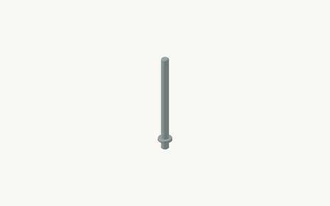
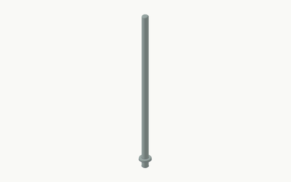
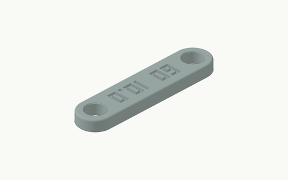
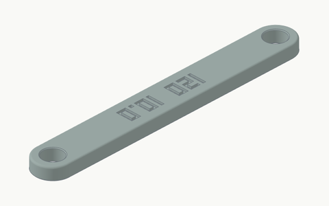

# Standard accessory gallery

This page shows the 65 accessories in the standard 60 mm unit / 13 mm thickness catalogue for the documented 350 x 320 x 325 mm build space. Each thumbnail comes from that part's STEP file. Custom interface settings or another build space can change dimensions and what fits.

Click a thumbnail for the full-size image. The code name is the generator name. Parts in one family share a scale; different families use different scales so small details stay readable. Colour is only for the pictures.

[Back to the beginner guide](../README.md) / [Thumbnail dimensions, hashes and source provenance](images/attachments/manifest.json)

Round-hole rods stand 120 or 240 mm above the mat. Their Ø18 mm stop collar seats on the mat; the Ø10 mm shaft and selected peg diameter stay physical sizes. The two upper braces join rod centres 60 or 120 mm apart, independent of unit size. The [rod and brace overview](images/rods-and-braces.png) shows all four catalogue parts; optional 10.2 and 10.4 mm bores are available as individual parts, not additional catalogue rows.

Keep bags resting on the mat. Braces are friction-fit links, not a positive height lock; they may slide or jam. These parts have no hooks or load/crash rating. Bambu projects turn only rod objects Y=90 onto their side and enable normal Auto support; braces stay flat with their bores along Z and no object support. Remove rod support before fitting.

Bracket names state both footprints. Deep tall is floor 1x2 -> wall 1x2, Wide low is floor 2x1 -> wall 2x1 and Deep square is floor 2x2 -> wall 2x2. Shallow tall is floor 1x1 -> wall 1x2, and Shallow wide is floor 2x1 -> wall 2x2. The two shallow IDs spell out `base..._wall...`; the original three keep their shorter IDs. Gallery examples use the standard 60 mm unit, 13 mm thickness and zero fit offset; custom matching parts use the same effective interface parameters.

The individual thumbnails show the bracket alone. The [family view](images/vertical-tile-brackets.png) adds separate floor and wall tiles to show assembly; those tiles are not included in the bracket export. Deep examples show the default underside-outward wall orientation, while shallow examples show the accepted top-outward orientation. Use one orientation consistently across adjoining wall tiles because top-outward placement reverses left/right joining handedness. Holes covered by the solid backing are blind while assembled.

Ramp names give width along the tile edge in unit cells. Every ramp keeps a 50 mm slope run; width, rise and one original tile-edge joint per cell follow its unit/thickness interface. Female is the default: it receives a north male tile edge and extends in positive Y. Male tabs fit female south or west tile edges after placement rotation; these are tile-edge joints, not X plugs. At standard 60/13 settings, male tabs project another 6 mm beyond the slope, so overall depth is 56 mm. Full-height ramp joints are not available.

Normal `vertical-stop` names give base X units, base Y units and the physical H60/H120 shoulder height. They are filled CAD wedges with no wall holes, panel connectors or ledges. The slicer still chooses perimeters and infill.

Original edge/corner bodies and straight rail bodies use R3. Rail ends use smaller rounds where the shape or STEP export needs them. Plates and stops use R2. Ramps have R2 sides/noses and a broad R32 shelf blend, capped to retain 2 mm of flat shelf on thicker custom parts. Brackets use R3 at the thick front-to-slope transition, R2 on other thick edges and R1 around the thin bearing lip. Mating surfaces keep their own geometry.

Before packing, Bambu projects put plates broad-face-down at X=180, original brackets on their diagonal rear face, shallow brackets side-down at Y=-90, normal stops on their broad rear face and angled stops back-down at X=-135. STEP, STL and core 3MF keep source orientation. Female ramps, normal stops and shallow brackets turn on Auto support for that object; male ramps leave it off. Remove support from mating areas before assembly. Physical fit and support removal still need checking on a print.

## Round-hole rods

<table><thead><tr><th width="206">Thumbnail</th><th>Name</th><th>Size / variant</th><th>What it does</th></tr></thead><tbody>
<tr><td width="206"><a href="images/attachments/rod-120.png"></a></td><td><code>rod_<wbr>h120_<wbr>peg10</code><br>Key: <code>rod-120</code></td><td>120 mm above mat / 10 mm peg<br>Bounds: 18.0 x 18.0 x 132.0 mm</td><td>A 10 mm shaft with a stop collar and a round mat peg. Height is measured above the mat; Bambu projects lay rods horizontally at Y=90 with normal Auto support for these objects.</td></tr>
<tr><td width="206"><a href="images/attachments/rod-240.png"></a></td><td><code>rod_<wbr>h240_<wbr>peg10</code><br>Key: <code>rod-240</code></td><td>240 mm above mat / 10 mm peg<br>Bounds: 18.0 x 18.0 x 252.0 mm</td><td>A 10 mm shaft with a stop collar and a round mat peg. Height is measured above the mat; Bambu projects lay rods horizontally at Y=90 with normal Auto support for these objects.</td></tr>
</tbody></table>

## Upper rod braces

<table><thead><tr><th width="206">Thumbnail</th><th>Name</th><th>Size / variant</th><th>What it does</th></tr></thead><tbody>
<tr><td width="206"><a href="images/attachments/rod-brace-60-d10.png"></a></td><td><code>rod-brace_<wbr>c60_<wbr>bore10</code><br>Key: <code>rod-brace-60-d10</code></td><td>60 mm centres / 10 mm bores<br>Bounds: 78.0 x 18.0 x 6.4 mm</td><td>A labelled two-bore link for round rods. Spacing is physical millimetres, not unit cells. Print flat with bores upright and no object support. Nominal 10.0 mm bore fit is user-reported; tested spacing(s) were not specified.</td></tr>
<tr><td width="206"><a href="images/attachments/rod-brace-120-d10.png"></a></td><td><code>rod-brace_<wbr>c120_<wbr>bore10</code><br>Key: <code>rod-brace-120-d10</code></td><td>120 mm centres / 10 mm bores<br>Bounds: 138.0 x 18.0 x 6.4 mm</td><td>A labelled two-bore link for round rods. Spacing is physical millimetres, not unit cells. Print flat with bores upright and no object support. Nominal 10.0 mm bore fit is user-reported; tested spacing(s) were not specified.</td></tr>
</tbody></table>

## Floor ramps

<table><thead><tr><th width="206">Thumbnail</th><th>Name</th><th>Size / variant</th><th>What it does</th></tr></thead><tbody>
<tr><td width="206"><a href="images/attachments/ramp-1.png"></a></td><td><code>ramp_<wbr>1_<wbr>original</code><br>Key: <code>ramp-1</code></td><td>1 cell width / 50 mm run<br>Bounds: 60.0 x 50.0 x 13.0 mm</td><td>A 50 mm slope with original female tile-edge pockets. Receives a north male tile edge and extends in positive Y. Bambu projects enable Auto support for the pocket roofs; remove it before assembly.</td></tr>
<tr><td width="206"><a href="images/attachments/ramp-2.png"></a></td><td><code>ramp_<wbr>2_<wbr>original</code><br>Key: <code>ramp-2</code></td><td>2 cell width / 50 mm run<br>Bounds: 120.0 x 50.0 x 13.0 mm</td><td>A 50 mm slope with original female tile-edge pockets. Receives a north male tile edge and extends in positive Y. Bambu projects enable Auto support for the pocket roofs; remove it before assembly.</td></tr>
<tr><td width="206"><a href="images/attachments/ramp-3.png"></a></td><td><code>ramp_<wbr>3_<wbr>original</code><br>Key: <code>ramp-3</code></td><td>3 cell width / 50 mm run<br>Bounds: 180.0 x 50.0 x 13.0 mm</td><td>A 50 mm slope with original female tile-edge pockets. Receives a north male tile edge and extends in positive Y. Bambu projects enable Auto support for the pocket roofs; remove it before assembly.</td></tr>
<tr><td width="206"><a href="images/attachments/ramp-4.png"></a></td><td><code>ramp_<wbr>4_<wbr>original</code><br>Key: <code>ramp-4</code></td><td>4 cell width / 50 mm run<br>Bounds: 240.0 x 50.0 x 13.0 mm</td><td>A 50 mm slope with original female tile-edge pockets. Receives a north male tile edge and extends in positive Y. Bambu projects enable Auto support for the pocket roofs; remove it before assembly.</td></tr>
<tr><td width="206"><a href="images/attachments/ramp-5.png"></a></td><td><code>ramp_<wbr>5_<wbr>original</code><br>Key: <code>ramp-5</code></td><td>5 cell width / 50 mm run<br>Bounds: 300.0 x 50.0 x 13.0 mm</td><td>A 50 mm slope with original female tile-edge pockets. Receives a north male tile edge and extends in positive Y. Bambu projects enable Auto support for the pocket roofs; remove it before assembly.</td></tr>
<tr><td width="206"><a href="images/attachments/ramp-male-1.png"></a></td><td><code>ramp_<wbr>1_<wbr>male_<wbr>original</code><br>Key: <code>ramp-male-1</code></td><td>1 cell width / 50 mm run<br>Bounds: 60.0 x 56.0 x 13.0 mm</td><td>A 50 mm slope with original male tile-edge tabs, not X plugs. Tabs add 6 mm beyond the slope at standard unit size. Place against a female south or west tile edge. Bambu projects leave object support off.</td></tr>
<tr><td width="206"><a href="images/attachments/ramp-male-2.png"></a></td><td><code>ramp_<wbr>2_<wbr>male_<wbr>original</code><br>Key: <code>ramp-male-2</code></td><td>2 cell width / 50 mm run<br>Bounds: 120.0 x 56.0 x 13.0 mm</td><td>A 50 mm slope with original male tile-edge tabs, not X plugs. Tabs add 6 mm beyond the slope at standard unit size. Place against a female south or west tile edge. Bambu projects leave object support off.</td></tr>
<tr><td width="206"><a href="images/attachments/ramp-male-3.png"></a></td><td><code>ramp_<wbr>3_<wbr>male_<wbr>original</code><br>Key: <code>ramp-male-3</code></td><td>3 cell width / 50 mm run<br>Bounds: 180.0 x 56.0 x 13.0 mm</td><td>A 50 mm slope with original male tile-edge tabs, not X plugs. Tabs add 6 mm beyond the slope at standard unit size. Place against a female south or west tile edge. Bambu projects leave object support off.</td></tr>
<tr><td width="206"><a href="images/attachments/ramp-male-4.png"></a></td><td><code>ramp_<wbr>4_<wbr>male_<wbr>original</code><br>Key: <code>ramp-male-4</code></td><td>4 cell width / 50 mm run<br>Bounds: 240.0 x 56.0 x 13.0 mm</td><td>A 50 mm slope with original male tile-edge tabs, not X plugs. Tabs add 6 mm beyond the slope at standard unit size. Place against a female south or west tile edge. Bambu projects leave object support off.</td></tr>
<tr><td width="206"><a href="images/attachments/ramp-male-5.png"></a></td><td><code>ramp_<wbr>5_<wbr>male_<wbr>original</code><br>Key: <code>ramp-male-5</code></td><td>5 cell width / 50 mm run<br>Bounds: 300.0 x 56.0 x 13.0 mm</td><td>A 50 mm slope with original male tile-edge tabs, not X plugs. Tabs add 6 mm beyond the slope at standard unit size. Place against a female south or west tile edge. Bambu projects leave object support off.</td></tr>
</tbody></table>

## Attachment plates

<table><thead><tr><th width="206">Thumbnail</th><th>Name</th><th>Size / variant</th><th>What it does</th></tr></thead><tbody>
<tr><td width="206"><a href="images/attachments/plate-1x1.png"></a></td><td><code>plate_<wbr>1x1_<wbr>original</code><br>Key: <code>plate-1x1</code></td><td>1 x 1<br>Bounds: 60.0 x 60.0 x 16.9 mm</td><td>A flat R2 body with matching X plugs underneath. Bambu projects place the broad face on the bed so the plugs grow upward.</td></tr>
<tr><td width="206"><a href="images/attachments/plate-1x2.png"></a></td><td><code>plate_<wbr>1x2_<wbr>original</code><br>Key: <code>plate-1x2</code></td><td>1 x 2<br>Bounds: 60.0 x 120.0 x 16.9 mm</td><td>A flat R2 body with matching X plugs underneath. Bambu projects place the broad face on the bed so the plugs grow upward.</td></tr>
<tr><td width="206"><a href="images/attachments/plate-2x2.png"></a></td><td><code>plate_<wbr>2x2_<wbr>original</code><br>Key: <code>plate-2x2</code></td><td>2 x 2<br>Bounds: 120.0 x 120.0 x 16.9 mm</td><td>A flat R2 body with matching X plugs underneath. Bambu projects place the broad face on the bed so the plugs grow upward.</td></tr>
</tbody></table>

## Vertical tile brackets

<table><thead><tr><th width="206">Thumbnail</th><th>Name</th><th>Size / variant</th><th>What it does</th></tr></thead><tbody>
<tr><td width="206"><a href="images/attachments/vertical-tile-bracket-1x2.png"></a></td><td><code>vertical-tile-bracket_<wbr>1x2_<wbr>original</code><br>Key: <code>vertical-tile-bracket-1x2</code></td><td>floor base 1 x 2 / wall 1 x 2<br>Bounds: 60.0 x 120.0 x 140.4 mm</td><td>A filled wedge that holds a separate tile upright. All five use R3 at the exposed front-to-slope transition; two shallow versions keep one floor row under a two-row wall.</td></tr>
<tr><td width="206"><a href="images/attachments/vertical-tile-bracket-2x1.png"></a></td><td><code>vertical-tile-bracket_<wbr>2x1_<wbr>original</code><br>Key: <code>vertical-tile-bracket-2x1</code></td><td>floor base 2 x 1 / wall 2 x 1<br>Bounds: 120.0 x 60.0 x 80.4 mm</td><td>A filled wedge that holds a separate tile upright. All five use R3 at the exposed front-to-slope transition; two shallow versions keep one floor row under a two-row wall.</td></tr>
<tr><td width="206"><a href="images/attachments/vertical-tile-bracket-2x2.png"></a></td><td><code>vertical-tile-bracket_<wbr>2x2_<wbr>original</code><br>Key: <code>vertical-tile-bracket-2x2</code></td><td>floor base 2 x 2 / wall 2 x 2<br>Bounds: 120.0 x 120.0 x 140.4 mm</td><td>A filled wedge that holds a separate tile upright. All five use R3 at the exposed front-to-slope transition; two shallow versions keep one floor row under a two-row wall.</td></tr>
<tr><td width="206"><a href="images/attachments/vertical-tile-bracket-base1x1-wall1x2.png"></a></td><td><code>vertical-tile-bracket_<wbr>base1x1_<wbr>wall1x2_<wbr>original</code><br>Key: <code>vertical-tile-bracket-base1x1-wall1x2</code></td><td>floor base 1 x 1 / wall 1 x 2<br>Bounds: 60.0 x 60.0 x 140.4 mm</td><td>A filled wedge that holds a separate tile upright. All five use R3 at the exposed front-to-slope transition; two shallow versions keep one floor row under a two-row wall.</td></tr>
<tr><td width="206"><a href="images/attachments/vertical-tile-bracket-base2x1-wall2x2.png"></a></td><td><code>vertical-tile-bracket_<wbr>base2x1_<wbr>wall2x2_<wbr>original</code><br>Key: <code>vertical-tile-bracket-base2x1-wall2x2</code></td><td>floor base 2 x 1 / wall 2 x 2<br>Bounds: 120.0 x 60.0 x 140.4 mm</td><td>A filled wedge that holds a separate tile upright. All five use R3 at the exposed front-to-slope transition; two shallow versions keep one floor row under a two-row wall.</td></tr>
</tbody></table>

## Normal full-solid stops

<table><thead><tr><th width="206">Thumbnail</th><th>Name</th><th>Size / variant</th><th>What it does</th></tr></thead><tbody>
<tr><td width="206"><a href="images/attachments/vertical-stop-1x1-h60.png"></a></td><td><code>vertical-stop_<wbr>1x1_<wbr>h60_<wbr>original</code><br>Key: <code>vertical-stop-1x1-h60</code></td><td>1 x 1 / H 60 mm<br>Bounds: 60.0 x 60.0 x 72.8 mm</td><td>A full-width cargo wedge with no wall holes or open ribs. Free outer edges are R2. Bambu projects place the broad rear face on the bed and enable Auto support for this part.</td></tr>
<tr><td width="206"><a href="images/attachments/vertical-stop-1x1-h120.png"></a></td><td><code>vertical-stop_<wbr>1x1_<wbr>h120_<wbr>original</code><br>Key: <code>vertical-stop-1x1-h120</code></td><td>1 x 1 / H 120 mm<br>Bounds: 60.0 x 60.0 x 132.8 mm</td><td>A full-width cargo wedge with no wall holes or open ribs. Free outer edges are R2. Bambu projects place the broad rear face on the bed and enable Auto support for this part.</td></tr>
<tr><td width="206"><a href="images/attachments/vertical-stop-1x2-h60.png"></a></td><td><code>vertical-stop_<wbr>1x2_<wbr>h60_<wbr>original</code><br>Key: <code>vertical-stop-1x2-h60</code></td><td>1 x 2 / H 60 mm<br>Bounds: 60.0 x 120.0 x 72.8 mm</td><td>A full-width cargo wedge with no wall holes or open ribs. Free outer edges are R2. Bambu projects place the broad rear face on the bed and enable Auto support for this part.</td></tr>
<tr><td width="206"><a href="images/attachments/vertical-stop-1x2-h120.png"></a></td><td><code>vertical-stop_<wbr>1x2_<wbr>h120_<wbr>original</code><br>Key: <code>vertical-stop-1x2-h120</code></td><td>1 x 2 / H 120 mm<br>Bounds: 60.0 x 120.0 x 132.8 mm</td><td>A full-width cargo wedge with no wall holes or open ribs. Free outer edges are R2. Bambu projects place the broad rear face on the bed and enable Auto support for this part.</td></tr>
<tr><td width="206"><a href="images/attachments/vertical-stop-2x1-h60.png"></a></td><td><code>vertical-stop_<wbr>2x1_<wbr>h60_<wbr>original</code><br>Key: <code>vertical-stop-2x1-h60</code></td><td>2 x 1 / H 60 mm<br>Bounds: 120.0 x 60.0 x 72.8 mm</td><td>A full-width cargo wedge with no wall holes or open ribs. Free outer edges are R2. Bambu projects place the broad rear face on the bed and enable Auto support for this part.</td></tr>
<tr><td width="206"><a href="images/attachments/vertical-stop-2x1-h120.png"></a></td><td><code>vertical-stop_<wbr>2x1_<wbr>h120_<wbr>original</code><br>Key: <code>vertical-stop-2x1-h120</code></td><td>2 x 1 / H 120 mm<br>Bounds: 120.0 x 60.0 x 132.8 mm</td><td>A full-width cargo wedge with no wall holes or open ribs. Free outer edges are R2. Bambu projects place the broad rear face on the bed and enable Auto support for this part.</td></tr>
<tr><td width="206"><a href="images/attachments/vertical-stop-2x2-h60.png"></a></td><td><code>vertical-stop_<wbr>2x2_<wbr>h60_<wbr>original</code><br>Key: <code>vertical-stop-2x2-h60</code></td><td>2 x 2 / H 60 mm<br>Bounds: 120.0 x 120.0 x 72.8 mm</td><td>A full-width cargo wedge with no wall holes or open ribs. Free outer edges are R2. Bambu projects place the broad rear face on the bed and enable Auto support for this part.</td></tr>
<tr><td width="206"><a href="images/attachments/vertical-stop-2x2-h120.png"></a></td><td><code>vertical-stop_<wbr>2x2_<wbr>h120_<wbr>original</code><br>Key: <code>vertical-stop-2x2-h120</code></td><td>2 x 2 / H 120 mm<br>Bounds: 120.0 x 120.0 x 132.8 mm</td><td>A full-width cargo wedge with no wall holes or open ribs. Free outer edges are R2. Bambu projects place the broad rear face on the bed and enable Auto support for this part.</td></tr>
</tbody></table>

## Angled stops

<table><thead><tr><th width="206">Thumbnail</th><th>Name</th><th>Size / variant</th><th>What it does</th></tr></thead><tbody>
<tr><td width="206"><a href="images/attachments/lock-45-1x1.png"></a></td><td><code>lock-45_<wbr>1x1_<wbr>h50_<wbr>original</code><br>Key: <code>lock-45-1x1</code></td><td>1 x 1 / H 50 mm<br>Bounds: 60.0 x 60.0 x 62.8 mm</td><td>A full-width angled cargo wedge with a 6 mm horizontal cap and R2 free edges. Bambu projects place its back face on the bed.</td></tr>
<tr><td width="206"><a href="images/attachments/lock-45-2x2.png"></a></td><td><code>lock-45_<wbr>2x2_<wbr>h50_<wbr>original</code><br>Key: <code>lock-45-2x2</code></td><td>2 x 2 / H 50 mm<br>Bounds: 120.0 x 120.0 x 62.8 mm</td><td>A full-width angled cargo wedge with a 6 mm horizontal cap and R2 free edges. Bambu projects place its back face on the bed.</td></tr>
</tbody></table>

## Male edge strips

<table><thead><tr><th width="206">Thumbnail</th><th>Name</th><th>Size / variant</th><th>What it does</th></tr></thead><tbody>
<tr><td width="206"><a href="images/attachments/edge-x-1.png"></a></td><td><code>edge-x_<wbr>1_<wbr>original</code><br>Key: <code>edge-x-1</code></td><td>1 cell<br>Bounds: 60.0 x 16.0 x 13.0 mm</td><td>An R3 finishing strip with male tile-edge joints. Length follows the unit count.</td></tr>
<tr><td width="206"><a href="images/attachments/edge-x-2.png"></a></td><td><code>edge-x_<wbr>2_<wbr>original</code><br>Key: <code>edge-x-2</code></td><td>2 cells<br>Bounds: 120.0 x 16.0 x 13.0 mm</td><td>An R3 finishing strip with male tile-edge joints. Length follows the unit count.</td></tr>
<tr><td width="206"><a href="images/attachments/edge-x-3.png"></a></td><td><code>edge-x_<wbr>3_<wbr>original</code><br>Key: <code>edge-x-3</code></td><td>3 cells<br>Bounds: 180.0 x 16.0 x 13.0 mm</td><td>An R3 finishing strip with male tile-edge joints. Length follows the unit count.</td></tr>
<tr><td width="206"><a href="images/attachments/edge-x-4.png"></a></td><td><code>edge-x_<wbr>4_<wbr>original</code><br>Key: <code>edge-x-4</code></td><td>4 cells<br>Bounds: 240.0 x 16.0 x 13.0 mm</td><td>An R3 finishing strip with male tile-edge joints. Length follows the unit count.</td></tr>
<tr><td width="206"><a href="images/attachments/edge-x-5.png"></a></td><td><code>edge-x_<wbr>5_<wbr>original</code><br>Key: <code>edge-x-5</code></td><td>5 cells<br>Bounds: 300.0 x 16.0 x 13.0 mm</td><td>An R3 finishing strip with male tile-edge joints. Length follows the unit count.</td></tr>
</tbody></table>

## Female edge strips

<table><thead><tr><th width="206">Thumbnail</th><th>Name</th><th>Size / variant</th><th>What it does</th></tr></thead><tbody>
<tr><td width="206"><a href="images/attachments/edge-y-1.png"></a></td><td><code>edge-y_<wbr>1_<wbr>original</code><br>Key: <code>edge-y-1</code></td><td>1 cell<br>Bounds: 60.0 x 10.0 x 13.0 mm</td><td>An R3 finishing strip with female tile-edge joints. Length follows the unit count.</td></tr>
<tr><td width="206"><a href="images/attachments/edge-y-2.png"></a></td><td><code>edge-y_<wbr>2_<wbr>original</code><br>Key: <code>edge-y-2</code></td><td>2 cells<br>Bounds: 120.0 x 10.0 x 13.0 mm</td><td>An R3 finishing strip with female tile-edge joints. Length follows the unit count.</td></tr>
<tr><td width="206"><a href="images/attachments/edge-y-3.png"></a></td><td><code>edge-y_<wbr>3_<wbr>original</code><br>Key: <code>edge-y-3</code></td><td>3 cells<br>Bounds: 180.0 x 10.0 x 13.0 mm</td><td>An R3 finishing strip with female tile-edge joints. Length follows the unit count.</td></tr>
<tr><td width="206"><a href="images/attachments/edge-y-4.png"></a></td><td><code>edge-y_<wbr>4_<wbr>original</code><br>Key: <code>edge-y-4</code></td><td>4 cells<br>Bounds: 240.0 x 10.0 x 13.0 mm</td><td>An R3 finishing strip with female tile-edge joints. Length follows the unit count.</td></tr>
<tr><td width="206"><a href="images/attachments/edge-y-5.png"></a></td><td><code>edge-y_<wbr>5_<wbr>original</code><br>Key: <code>edge-y-5</code></td><td>5 cells<br>Bounds: 300.0 x 10.0 x 13.0 mm</td><td>An R3 finishing strip with female tile-edge joints. Length follows the unit count.</td></tr>
</tbody></table>

## Inner corners

<table><thead><tr><th width="206">Thumbnail</th><th>Name</th><th>Size / variant</th><th>What it does</th></tr></thead><tbody>
<tr><td width="206"><a href="images/attachments/corner-in-v1.png"></a></td><td><code>corner-in_<wbr>v1_<wbr>original</code><br>Key: <code>corner-in-v1</code></td><td>variant 1<br>Bounds: 60.0 x 66.0 x 13.0 mm</td><td>An R3 corner finishing piece in one of four supported joining arrangements.</td></tr>
<tr><td width="206"><a href="images/attachments/corner-in-v2.png"></a></td><td><code>corner-in_<wbr>v2_<wbr>original</code><br>Key: <code>corner-in-v2</code></td><td>variant 2<br>Bounds: 66.0 x 66.0 x 13.0 mm</td><td>An R3 corner finishing piece in one of four supported joining arrangements.</td></tr>
<tr><td width="206"><a href="images/attachments/corner-in-v3.png"></a></td><td><code>corner-in_<wbr>v3_<wbr>original</code><br>Key: <code>corner-in-v3</code></td><td>variant 3<br>Bounds: 66.0 x 60.0 x 13.0 mm</td><td>An R3 corner finishing piece in one of four supported joining arrangements.</td></tr>
<tr><td width="206"><a href="images/attachments/corner-in-v4.png"></a></td><td><code>corner-in_<wbr>v4_<wbr>original</code><br>Key: <code>corner-in-v4</code></td><td>variant 4<br>Bounds: 60.0 x 60.0 x 13.0 mm</td><td>An R3 corner finishing piece in one of four supported joining arrangements.</td></tr>
</tbody></table>

## Outer corners

<table><thead><tr><th width="206">Thumbnail</th><th>Name</th><th>Size / variant</th><th>What it does</th></tr></thead><tbody>
<tr><td width="206"><a href="images/attachments/corner-out-v1.png"></a></td><td><code>corner-out_<wbr>v1_<wbr>original</code><br>Key: <code>corner-out-v1</code></td><td>variant 1<br>Bounds: 16.0 x 67.1 x 13.0 mm</td><td>An R3 outer-edge finishing piece in one of six supported arrangements.</td></tr>
<tr><td width="206"><a href="images/attachments/corner-out-v2.png"></a></td><td><code>corner-out_<wbr>v2_<wbr>original</code><br>Key: <code>corner-out-v2</code></td><td>variant 2<br>Bounds: 67.1 x 10.0 x 13.0 mm</td><td>An R3 outer-edge finishing piece in one of six supported arrangements.</td></tr>
<tr><td width="206"><a href="images/attachments/corner-out-v3.png"></a></td><td><code>corner-out_<wbr>v3_<wbr>original</code><br>Key: <code>corner-out-v3</code></td><td>variant 3<br>Bounds: 70.0 x 70.0 x 13.0 mm</td><td>An R3 outer-edge finishing piece in one of six supported arrangements.</td></tr>
<tr><td width="206"><a href="images/attachments/corner-out-v4.png"></a></td><td><code>corner-out_<wbr>v4_<wbr>original</code><br>Key: <code>corner-out-v4</code></td><td>variant 4<br>Bounds: 10.0 x 67.1 x 13.0 mm</td><td>An R3 outer-edge finishing piece in one of six supported arrangements.</td></tr>
<tr><td width="206"><a href="images/attachments/corner-out-v5.png"></a></td><td><code>corner-out_<wbr>v5_<wbr>original</code><br>Key: <code>corner-out-v5</code></td><td>variant 5<br>Bounds: 67.1 x 16.0 x 13.0 mm</td><td>An R3 outer-edge finishing piece in one of six supported arrangements.</td></tr>
<tr><td width="206"><a href="images/attachments/corner-out-v6.png"></a></td><td><code>corner-out_<wbr>v6_<wbr>original</code><br>Key: <code>corner-out-v6</code></td><td>variant 6<br>Bounds: 70.0 x 70.0 x 13.0 mm</td><td>An R3 outer-edge finishing piece in one of six supported arrangements.</td></tr>
</tbody></table>

## Support rails

<table><thead><tr><th width="206">Thumbnail</th><th>Name</th><th>Size / variant</th><th>What it does</th></tr></thead><tbody>
<tr><td width="206"><a href="images/attachments/support-1.png"></a></td><td><code>support_<wbr>1_<wbr>original</code><br>Key: <code>support-1</code></td><td>1 cell<br>Bounds: 45.0 x 65.0 x 25.0 mm</td><td>A physical bearing rail with an R3 body, rounded windows and its own end-to-end dovetails.</td></tr>
<tr><td width="206"><a href="images/attachments/support-2.png"></a></td><td><code>support_<wbr>2_<wbr>original</code><br>Key: <code>support-2</code></td><td>2 cells<br>Bounds: 45.0 x 125.0 x 25.0 mm</td><td>A physical bearing rail with an R3 body, rounded windows and its own end-to-end dovetails.</td></tr>
<tr><td width="206"><a href="images/attachments/support-3.png"></a></td><td><code>support_<wbr>3_<wbr>original</code><br>Key: <code>support-3</code></td><td>3 cells<br>Bounds: 45.0 x 185.0 x 25.0 mm</td><td>A physical bearing rail with an R3 body, rounded windows and its own end-to-end dovetails.</td></tr>
<tr><td width="206"><a href="images/attachments/support-4.png"></a></td><td><code>support_<wbr>4_<wbr>original</code><br>Key: <code>support-4</code></td><td>4 cells<br>Bounds: 45.0 x 245.0 x 25.0 mm</td><td>A physical bearing rail with an R3 body, rounded windows and its own end-to-end dovetails.</td></tr>
<tr><td width="206"><a href="images/attachments/support-5.png"></a></td><td><code>support_<wbr>5_<wbr>original</code><br>Key: <code>support-5</code></td><td>5 cells<br>Bounds: 45.0 x 305.0 x 25.0 mm</td><td>A physical bearing rail with an R3 body, rounded windows and its own end-to-end dovetails.</td></tr>
</tbody></table>

## Rail ends

<table><thead><tr><th width="206">Thumbnail</th><th>Name</th><th>Size / variant</th><th>What it does</th></tr></thead><tbody>
<tr><td width="206"><a href="images/attachments/support-end-v1.png"></a></td><td><code>support-end_<wbr>v1_<wbr>original</code><br>Key: <code>support-end-v1</code></td><td>variant 1 / X<br>Bounds: 45.0 x 120.0 x 25.0 mm</td><td>A rounded ramped rail end. X, Xs, Y and Ys are the four arrangements; smaller radii keep the acute shapes and STEP exports sound.</td></tr>
<tr><td width="206"><a href="images/attachments/support-end-v2.png"></a></td><td><code>support-end_<wbr>v2_<wbr>original</code><br>Key: <code>support-end-v2</code></td><td>variant 2 / Xs<br>Bounds: 45.0 x 120.0 x 25.0 mm</td><td>A rounded ramped rail end. X, Xs, Y and Ys are the four arrangements; smaller radii keep the acute shapes and STEP exports sound.</td></tr>
<tr><td width="206"><a href="images/attachments/support-end-v3.png"></a></td><td><code>support-end_<wbr>v3_<wbr>original</code><br>Key: <code>support-end-v3</code></td><td>variant 3 / Y<br>Bounds: 45.0 x 125.0 x 25.0 mm</td><td>A rounded ramped rail end. X, Xs, Y and Ys are the four arrangements; smaller radii keep the acute shapes and STEP exports sound.</td></tr>
<tr><td width="206"><a href="images/attachments/support-end-v4.png"></a></td><td><code>support-end_<wbr>v4_<wbr>original</code><br>Key: <code>support-end-v4</code></td><td>variant 4 / Ys<br>Bounds: 45.0 x 125.0 x 25.0 mm</td><td>A rounded ramped rail end. X, Xs, Y and Ys are the four arrangements; smaller radii keep the acute shapes and STEP exports sound.</td></tr>
</tbody></table>

## Rail connectors

<table><thead><tr><th width="206">Thumbnail</th><th>Name</th><th>Size / variant</th><th>What it does</th></tr></thead><tbody>
<tr><td width="206"><a href="images/attachments/support-bit-20mm.png"></a></td><td><code>support-bit_<wbr>20mm_<wbr>original</code><br>Key: <code>support-bit-20mm</code></td><td>20 mm length<br>Bounds: 45.0 x 25.0 x 25.0 mm</td><td>A rounded rail connector with a projecting join; the label gives its specified length.</td></tr>
<tr><td width="206"><a href="images/attachments/support-bit-30mm.png"></a></td><td><code>support-bit_<wbr>30mm_<wbr>original</code><br>Key: <code>support-bit-30mm</code></td><td>30 mm length<br>Bounds: 45.0 x 35.0 x 25.0 mm</td><td>A rounded rail connector with a projecting join; the label gives its specified length.</td></tr>
<tr><td width="206"><a href="images/attachments/support-bit-40mm.png"></a></td><td><code>support-bit_<wbr>40mm_<wbr>original</code><br>Key: <code>support-bit-40mm</code></td><td>40 mm length<br>Bounds: 45.0 x 45.0 x 25.0 mm</td><td>A rounded rail connector with a projecting join; the label gives its specified length.</td></tr>
<tr><td width="206"><a href="images/attachments/support-bit-50mm.png"></a></td><td><code>support-bit_<wbr>50mm_<wbr>original</code><br>Key: <code>support-bit-50mm</code></td><td>50 mm length<br>Bounds: 45.0 x 55.0 x 25.0 mm</td><td>A rounded rail connector with a projecting join; the label gives its specified length.</td></tr>
</tbody></table>


## Reproduce the images

Use a CAD-Pilot checkout at the recorded workbench revision with its render dependencies installed. Cargo-Grid doesn't add them as runtime dependencies. From this repository root, run:

```sh
PYTHONPATH=src <workbench-python> tools/render_docs.py --workbench <workbench-checkout> --geometry-revision <committed-generator-revision> --workbench-revision <recorded-workbench-revision>
```

Use the workbench's Python interpreter with Pillow already available; paths are supplied locally, not committed. In PowerShell, set `$env:PYTHONPATH='src'` before invoking that interpreter. A full run checks geometry modules against the recorded commit, invokes STEP/inspection/render tools, then creates 7 overview PNGs and 65 family-scaled thumbnails. `--compose-only` reuses verified local STEP-derived renders; `--check` verifies the committed files and their one-to-one inventory mapping without Pillow. Intermediate STEP files and raw renders remain ignored. Layout is deterministic; raster bytes can depend on graphics/Pillow versions.

For a ramp-only update, add `--update-ramps --geometry-revision <committed-generator-revision> --workbench-revision <recorded-workbench-revision>`. This renders all ten ramps and recomposes only the ramp overview. Other pictures and their original provenance stay unchanged; no earlier render cache is needed.

For a rod-and-brace update, use `--update-rods` with those revision options. It renders only the two rods and two nominal 10 mm braces, then creates their four thumbnails and one overview. All other image bytes and provenance stay unchanged.

The manifest's top-level provenance belongs to the retained baseline images. Incrementally rendered thumbnails and overviews each carry their own provenance; it does not describe a new full-gallery render. Rod and brace update source revision: <code>5296a5bf<wbr>605d5c9b<wbr>e7ac2b75<wbr>3da068f4<wbr>6125a81c</code>. Generator tree: <code>8525b860<wbr>4683cfd4<wbr>b882e642<wbr>5b69fb57<wbr>6decd421</code>. Workbench revision: <code>ff5b2181<wbr>afec7f80<wbr>571fbb95<wbr>f57dc244<wbr>418be2d2</code>.

A clean render checks the picture and source inventory; it doesn't prove print quality or fit.
